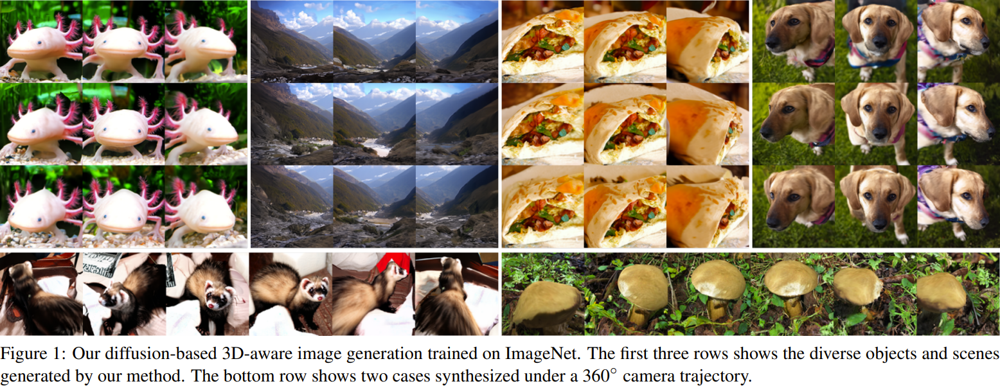

<h1 align="center">3D-aware Image Generation<br>using 2D Diffusion Models</h1>
<h5 align="center"><a href="https://jeffreyxiang.github.io">Jianfeng Xiang</a><sup>1,2</sup>&emsp;<a href="https://jlyang.org">Jiaolong Yang</a><sup>2</sup>&emsp;<a href="https://github.com/hbb1">Binbin Huang</a><sup>3</sup>&emsp;<a href="https://www.microsoft.com/en-us/research/people/xtong/">Xin Tong</a><sup>2</sup></h5>
<h5 align="center"><sup>1</sup><a href="https://www.tsinghua.edu.cn/en/">Tsinghua University</a>&emsp;<sup>2</sup><a href="https://www.microsoft.com/en-us/research/lab/microsoft-research-asia/">Microsoft Research Asia</a>&emsp;<sup>3</sup><a href="https://www.shanghaitech.edu.cn/eng/">ShanghaiTech University</a></h5>
<p align="center"><b>ICCV 2023</b></h5>
<p align="center"></p>

**Abstract:** *In this paper, we introduce a novel 3D-aware image generation method that leverages 2D diffusion models. We formulate the 3D-aware image generation task as multiview 2D image set generation, and further to a sequential unconditional–conditional multiview image generation process. This allows us to utilize 2D diffusion models to boost the generative modeling power of the method. Additionally, we incorporate depth information from monocular depth estimators to construct the training data for the conditional diffusion model using only still images. We train our method on a large-scale unstructured 2D image dataset, i.e., ImageNet, which is not addressed by previous methods. It produces high-quality images that significantly outperform prior methods. Furthermore, our approach showcases its capability to generate instances with large view angles, even though the training images are diverse and unaligned, gathered from “in-the-wild” realworld environments.*

<h4><a href="https://jeffreyxiang.github.io/ivid/">Project Page</a> | <a href="https://arxiv.org/pdf/2303.17905.pdf">Paper</a> | <a href="https://arxiv.org/abs/2303.17905">ArXiv</a></h4>

## Requirements
- Currently only Linux is supported.
- 64-bit Python 3.8 installation or newer. We recommend Anaconda3.
- One or more high-end NVIDIA GPUs with NVIDIA drivers installed. Our code is tested with NVIDIA V100 and A100 GPUs.

## Installation
Clone the repository and setup the environment with all dependencies as follows:
```
git clone https://github.com/JeffreyXiang/ivid.git
cd ivid
conda env create -f environment.yml
conda activate ivid
```

## Pretrained Models
Download the pretrained models from [HuggingFace](https://huggingface.co/JeffreyXiang/ivid/tree/main) and put them in the `ckpts` folder. The detailed description of the pretrained models is as follows:
| File | Description | Config |
| :-: | :-: | :-: |
| [imagenet128_uncond](https://huggingface.co/JeffreyXiang/ivid/blob/main/imagenet128_uncond.pt) | 128x128 unconditional diffusion model trained on ImageNet | `rgbd_imagenet_adm_128_large_cfg.json` |
| [imagenet128_cond](https://huggingface.co/JeffreyXiang/ivid/blob/main/imagenet128_cond.pt) | 128x128 conditional diffusion model trained on ImageNet | `rgbd_imagenet_adm_128_large_cond.json` |

## Inference
To generate multiview images from the pretrained models, run the following command:
```
python inference/sample.py

Options:
    --config_uncond   Config file for unconditional model
    --config_cond     Config file for conditional model
    --ckpt_uncond     Path to the checkpoint of unconditional model
    --ckpt_cond       Path to the checkpoint of conditional model
    --output_dir      Output directory
    --seeds           Seeds for the generated samples
    --num_samples     Number of samples. if specified, seeds will be ignored
    --classes         Classes for the generated samples
    --viewset         Viewset for the iterative sampling process
    --steps_uncond    Number of sampling steps for unconditional model
    --steps_cond      Number of sampling steps for conditional model
    --guidance        Classfiier-free guidance strength
    --batchsize       Batch size for inference
```
Currently, we support the following viewsets:

- `uncond`: only sample from the unconditional model
- `random`: Get one unconditional sample and one conditional novel view sample with yaw and pitch angles sampled from gaussian distributions with std 0.3 and 0.15, respectively.
- `3x9`: Get multiview samples uniformly covering -0.6 to 0.6 yaw angles and -0.15 to 0.15 pitch angles with 3 x 9 grid.

You can also modify the `sample.py` file to add your own viewset.

Once the 3D scenes are generated, our fusion-based free-view rendering method can be used to do fast free-view rendering:
```
python inference/render.py

Options:
    --scene_dir       Scene directory
    --output_dir      Output directory
    --frames          Number of frames
    --traj            Camera trajectory
```
Currently, we support the following trajectories:

- `swing`: Swing the camera around the object. Supplementary videos are rendered with this trajectory.
- `random`: Randomly sample one camera pose with yaw and pitch angles following gaussian distributions with std 0.3 and 0.15, respectively.

The generated samples will be saved in the `output_dir` folder:
```
output_dir
└── viewset_<*>_steps_<*>_guidance_<*>
    ├── conds       # condition images for conditional model
    ├── grids       # multiview image grids for visualization
    ├── results     # contains the samples for metrics evaluation
    ├── videos      # videos generated by our fusion-based free-view rendering method
    └── scenes      # final 3D scenes containing the generated multiview rgbd images
```

## Evaluation
If you want to sample by yourself, to generate samples without fusion-based free-view rendering method, run the following command:
```
python inference/sample.py --num_samples 10000 --classes uniform --viewset random --steps_uncond 1000 --steps_cond 50 --guidance 0.5
```
To generate samples with fusion-based free-view rendering method, run the following command:
```
python inference/sample.py --num_samples 10000 --classes uniform --viewset 3x9 --steps_uncond 1000 --steps_cond 50 --guidance 0.5
python inference/render.py --traj random
```
Since the inference process is time-consuming, we provide the generated samples for evaluation. Download the generated samples from [HuggingFace](https://huggingface.co/JeffreyXiang/ivid/tree/main).

To evaluate the generated samples, run the following command:
```
python eval.py

Options:
    --real_images_dir          Real images directory
    --fake_images_dir          Fake images directory
    --tmp_dir                  Temporary directory
    --image_size               Image size
    --num_samples              Number of samples
    --real_images_cache_name   Real images cache name
    --fake_images_cache_name   Fake images cache name
    --use_real_images_cache    Use real images cache
    --use_fake_images_cache    Use fake images cache
```

## Training from Scratch
### Data Preparation
Download the ImageNet dataset from [here](https://image-net.org/download.php) and put it anywhere you want. The directory structure should be like this:
```
ImageNet
├── images
│   ├── n01440764
│   │   ├── n01440764_10026.JPEG
│   │   └── ...
│   └── ...
├── depths
│   ├── n01440764
│   │   ├── n01440764_10026.npz
│   │   └── ...
│   └── ...
└── dataset.json
```
For datasets without class labels, The directory structure should be like this:
```
Dataset
├── images
│   ├── <image_name_1>.<image_ext>
│   └── ...
├── depths
│   ├── <image_name_1>.npz
│   └── ...
└── dataset.json
```
For depth data, we use [MiDaS](https://github.com/isl-org/MiDaS) `dpt_beit_large_512` to predict the depth maps of the images. The predicted depth maps are saved in `.npz` format with fp16 type. The `dataset.json` file is a json file containing the image paths and the corresponding depth paths, which will be automatically generated by training scripts.

### Training
To train the model, run the following command with the corresponding config file and the path to the prepared dataset:
```
python train.py

Options:
    --config          Config file
    --output_dir      Output directory
    --load_dir        Load directory, default to output_dir
    --ckpt            Checkpoint step, default to latest
    --data_dir        Data directory
    --num_nodes       Number of nodes, default to 1
    --node_rank       Node rank, default to 0
    --num_gpus        Number of GPUs per node, default to all
    --master_addr     Master address for distributed training, default to localhost
    --master_port     Port for distributed training, default to 12345

Example:
    # 128x128 unconditional model on ImageNet
    python train.py --config configs/rgbd_imagenet_adm_128_large_cfg.json --output_dir <output_dir> --data_dir <data_dir>

    # 128x128 conditional model on ImageNet
    python train.py --config configs/rgbd_imagenet_adm_128_large_cond.json --output_dir <output_dir> --data_dir <data_dir>

    # 128x128 unconditional model on single-category dataset
    python train.py --config configs/rgbd_singlecategory_adm_128_small.json --output_dir <output_dir> --data_dir <data_dir>

    # 128x128 conditional model on single-category dataset
    python train.py --config configs/rgbd_singlecategory_adm_128_small_cond.json --output_dir <output_dir> --data_dir <data_dir>
```
The code will automatically detect all available GPUs and use DDP training. You can use the provided configs add your own config.

## Citation
If you find our work useful in your research, please consider citing:
```
@inproceedings{xiang2023ivid,
    title={3D-aware Image Generation using 2D Diffusion Models},
    author={Xiang, Jianfeng and Yang, Jiaolong and Huang, Binbin and Tong, Xin},
    booktitle = {Proceedings of the IEEE/CVF International Conference on Computer Vision (ICCV)},
    month     = {October},
    year      = {2023},
    pages     = {2383-2393}
}
```
